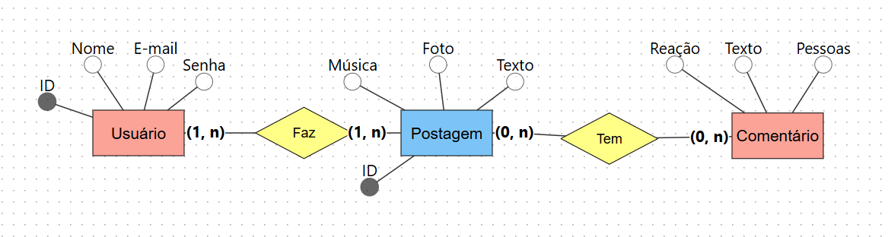

# Postagem com comentários
**Equipe de Desenvolvimento**: Pedro Ferraz

## 1. Visão Geral:

Um usuário faz um postagem e essa postagem tem comentários

## 2. Regras de Negócio

**RN01** O sistema deve gerenciar o cadastro e login dos seus usuários, com essas informações:

 - Nome
 - E_mail
 - Senha
 - ID

 **RN02** O sistema deve permitir que o usuário edite sua postagem com essas características:
 

 - Música
 - Foto
 - Texto
 - ID
 
 **RN03** O sistema deve permitir que o usuário editar as informações do comentário editando algumas características como por exemplo:
 

 - Texto
 - Pessoas
 - Reação

